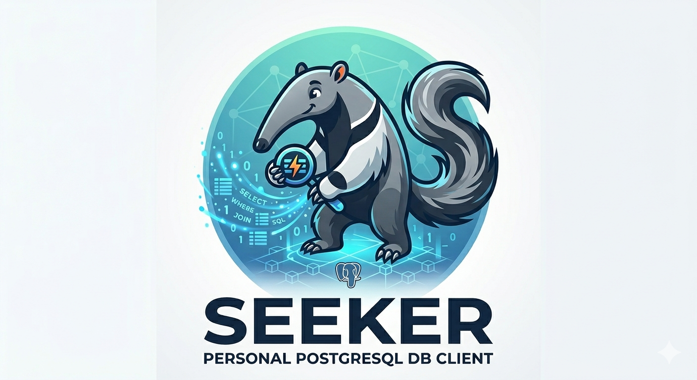

<p align="center">
  
</p>

<h1 align="center">Seeker</h1>

<p align="center">
  A personal PostgreSQL query tool built with Elixir and Phoenix LiveView.<br/>
  Run queries against remote databases from your browser — no GUI client required.
</p>

---

## What it is

Seeker is a lightweight web app that replaces tools like BeeKeeper Studio for day-to-day database querying. You configure one or more remote PostgreSQL connections, write (or pick) a query, and see the results as a table — all in the browser, with live connection-status badges that tell you whether the VPN is up.

It is designed to be:

- **Personal** — runs on `localhost`, not deployed anywhere
- **Organized** — queries are grouped by organization and context (e.g. Mobility, Insurances)
- **Git-friendly** — organizations and queries live in a gitignored local directory, so each user keeps their own setup without polluting shared history

## Features

- Live connection health badges (Connected / VPN down / Auth error)
- Predefined named queries, grouped by context, selectable from the sidebar
- Create, edit, and delete queries directly from the UI — no restart needed
- Ad-hoc SQL editor — edit any predefined query or write your own
- Results rendered as a scrollable table with row count and timing metadata
- Copy results as JSON with one click
- SSL support (`verify_peer` or `verify_none`)
- Dark / light / system theme toggle
- Credentials loaded from `.env` — never committed

## Requirements

- Elixir 1.19+ / Erlang 28+ (see `.tool-versions`)
- [just](https://github.com/casey/just) (task runner)
- The target database must be reachable (VPN, firewall, etc.)
- A `.env` file with your connection credentials (see below)

## Quick start

```bash
# 1. Install dependencies and set up assets
just setup

# 2. Copy the example env file and fill in your credentials
cp .env.example .env
# edit .env — set host, port, user, password, database name

# 3. Create your organization definition
mkdir -p priv/local/organizations
cp priv/local.example/organizations/acme.json priv/local/organizations/my_org.json
# edit my_org.json — set display name, environments, and $ENV_VAR references

# 4. Connect the VPN (if required by your database)

# 5. Start the server
just run
```

Open [http://localhost:4000](http://localhost:4000).

You can also open an IEx session alongside the server:

```bash
just iex
```

## Configuration

### Credentials (`.env`)

All database credentials live in `.env` at the project root. The file is gitignored — never commit it.

| Variable | Description |
|---|---|
| `JUST_TRAVEL_PROD_DB_HOST` | Production database hostname |
| `JUST_TRAVEL_PROD_DB_PORT` | Port (default `5432`) |
| `JUST_TRAVEL_PROD_DB_USER` | Username |
| `JUST_TRAVEL_PROD_DB_PASS` | Password |
| `JUST_TRAVEL_PROD_DB_NAME` | Database name |
| `JUST_TRAVEL_HOMO_DB_*` | Same fields for Homologation |
| `JUST_TRAVEL_DB_SSL_MODE` | `verify_peer` or `verify_none` |
| `JUST_TRAVEL_DB_SSL_CACERT` | Path to CA bundle (only for `verify_peer`) |

Add variables for any other organizations you add. See [docs/configuration.md](docs/configuration.md) for SSL details.

### Organizations (`priv/local/organizations/`)

Organizations are defined as JSON files in `priv/local/organizations/` — a gitignored directory. Each file describes one organization's display name, environments, and how to reach each database:

```json
{
  "display": "My Org",
  "environments": {
    "prod": {
      "display": "Production",
      "hostname": "$MY_ORG_PROD_DB_HOST",
      "port": "$MY_ORG_PROD_DB_PORT",
      "username": "$MY_ORG_PROD_DB_USER",
      "password": "$MY_ORG_PROD_DB_PASS",
      "database": "$MY_ORG_PROD_DB_NAME",
      "ssl_mode": "verify_none"
    }
  }
}
```

Values starting with `$` are resolved from environment variables at startup. See `priv/local.example/organizations/acme.json` for a full example and [docs/adding-organizations.md](docs/adding-organizations.md) for the complete guide.

### Queries (`priv/local/queries/`)

Queries are stored in `priv/local/queries/<org_slug>.json` — also gitignored. They can be created, edited, and deleted directly from the UI sidebar without restarting the server. See [docs/queries.md](docs/queries.md) for the file format.

## Project structure

```
priv/
  local/                        ← gitignored — your personal data
    organizations/
      just_travel.json          ← org definition (DB credentials via $ENV_VARs)
    queries/
      just_travel.json          ← all queries for that org
  local.example/                ← committed — format reference
    organizations/acme.json
    queries/acme.json
lib/
  seeker/
    local_config.ex             ← reads priv/local/ files
    org_registry.ex             ← runtime registry (persistent_term)
    dynamic_repo.ex             ← single Ecto.Repo, started per org/env
    query_store.ex              ← GenServer owning query state, persists to JSON
    sql_runner.ex               ← executes raw SQL against a named repo
    connection_monitor.ex       ← pings repos every 30s, publishes status
    query_result.ex             ← result struct
  seeker_web/
    live/
      query_live.ex             ← main LiveView (query execution + CRUD)
config/
  runtime.exs                   ← loads .env into system env via Dotenvy
.env                            ← your secrets (gitignored)
.env.example                    ← template to copy from
```

See [docs/architecture.md](docs/architecture.md) for a deeper explanation.

## Documentation

| Document | Description |
|---|---|
| [docs/architecture.md](docs/architecture.md) | How the system is designed and why |
| [docs/configuration.md](docs/configuration.md) | SSL, VPN, and environment variables |
| [docs/queries.md](docs/queries.md) | How to write and organize queries |
| [docs/adding-organizations.md](docs/adding-organizations.md) | Step-by-step guide for new organizations |
| [AGENTS.md](AGENTS.md) | How coding agents can run queries via `mix seeker.*` / `seeker` |
